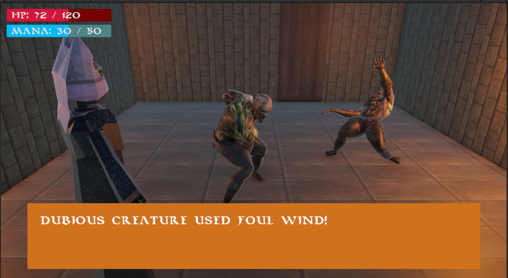

# Project Vessel (TITLE PENDING)
This is the main repo for Project Vessel, a WIP as the final project for Intro to Game Design II (WLLC 30403) by Buncha Goons.

[Watch our trailer here!](https://youtu.be/O_VKRhK4aV0?si=nyyHqTCY1EznqkPu)

## Description
There's a blight upon this land.

It saps the earth and all living creatures of the mana that runs in their veins.

In its wake, the manablight has destroyed crops, awoken dastardly monsters from slumber, and even taken the lives of the old and sickly.

For decades, researchers at the Royal Academy of Magic (RAM for short) have dedicated themselves to solving the mystery behind the cutoff of aether flow. For decades, they have failed. Once every 10 years, the King chooses the two top Magicians at RAM to travel to the nexus point of the blight -- a small mana research site located in the far north of the kingdom. 

There lives in this town a greatly renowned Scholar of Magic. He is known to have solved every issue the blight has caused the surrounding area, yet he rarely makes a public appearance. And when he does, he's always wearing a beautiful star-shaped mask. He does not speak to the citizens. He simply solves their problems and retreats to his manor on the far outskirts of the town.

Rumors float of his identity, and as with every magic-related mystery in this kingdom, they seem to all lead back to an ancient disaster. Centuries ago, a brilliant Magic Duo known as the Magician and the Scholar -- husband and wife -- had set out to discover the origin of the Mana that gives this world life. In their research, they realized they must experiment on themselves. The Scholar trusted her husband completely, and left her soul in his more-than-capable hands. Overwhelmed with this burden, the Magician grew hasty. It was in this haste that the experiment had gone terribly wrong. The Scholar's soul was lost, her physical form disappearing in front of the Magician's very eyes. After this, it is said that The Magician went into hiding, dropped his research, and was never seen again.

But what if he had somehow persisted? Fueled by regret and twisted passion, what if he spent the last 500 years searching for a way to bring his Wife back?
Rowan has been chosen, along with her friend Rachel, to journey to the center of the Blight, working with the mysterious mask-adorned mage to save the kingdom once and for all. As things take a dark turn, she will be forced to confront the dark side of Science and Magic in this traditional turn-based RPG with a straightforward magic system and simple puzzles to be solved in dungeon-crawling action.

The truth awaits you, young Vessel.

## Details
- Unity Version: 6000.3.5f1

## Credits
- Animations and Placeholder Models: [Mixamo](https://www.mixamo.com/#/) from [Adobe](https://www.adobe.com/)
- Dialogue Manager: [Charles Engine](https://www.charlesgames.net/charles-engine) from [Charles Games](https://www.charlesgames.net/)
- [CARCAXIS – Retro PSX Monster](https://imaginais.itch.io/carcaxis-retro-psx-monster) by [imaginais](https://imaginais.itch.io/) on itch.io
